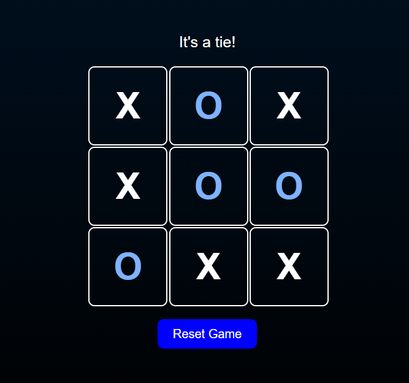

# Tic‑Tac‑Toe with Unbeatable AI

A classic Tic‑Tac‑Toe game where you play against an AI opponent. The AI uses the **minimax algorithm**, making it impossible to win. Can you force a draw?

  

## 🎮 Live Demo

Play the game here: [https://github.com/lakshita-rawat/tic-tac-toe.git](https://github.com/lakshita-rawat/tic-tac-toe.git)

## ✨ Features

- **Player vs AI** – you are ❌, AI is ⭕  
- **Unbeatable AI** – minimax algorithm ensures the AI never loses  
- **Clean & modern UI** – responsive design, glass‑morphism card, smooth animations  
- **Game status** – displays current turn, winner, or tie  
- **Reset button** – start a new game anytime  
- **Highlight winning cells** (optional) – shows the winning line  

## 🛠️ Tech Stack

- HTML5  
- CSS3 (Flexbox, Grid, custom properties)  
- JavaScript (ES6+)  
- Git & GitHub  
- GitHub Pages for hosting

## 🚀 How to Run Locally

1. **Clone the repository**  
   ```bash
   git clone https://github.com/yourusername/tic-tac-toe.git